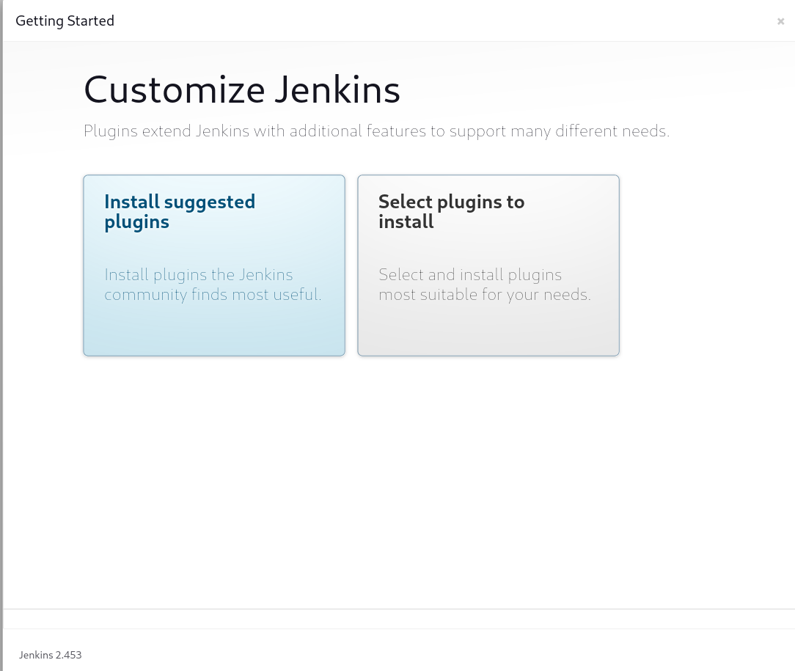
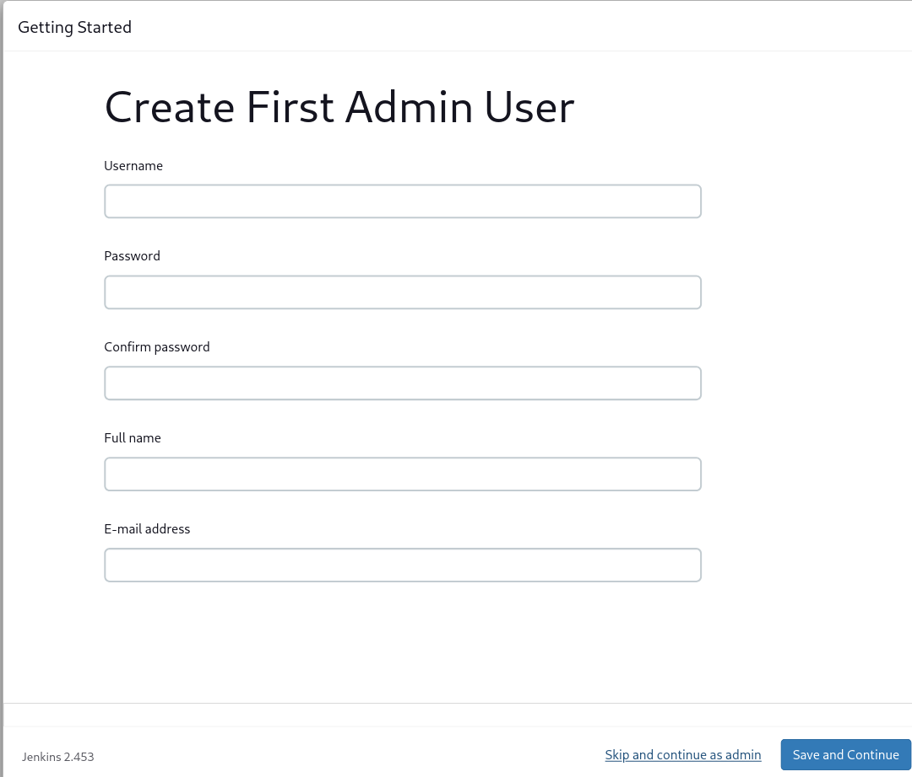
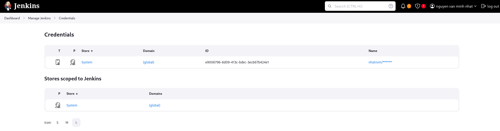
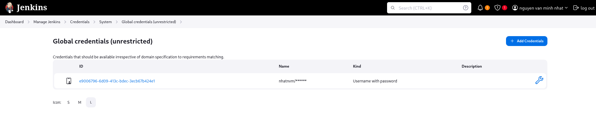
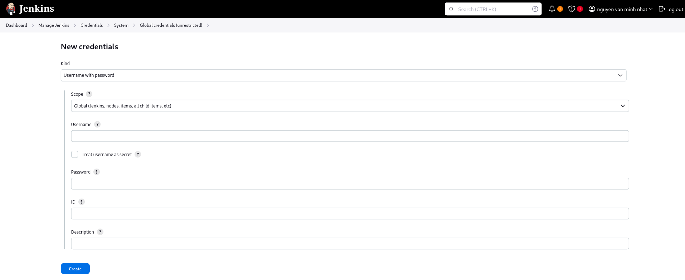
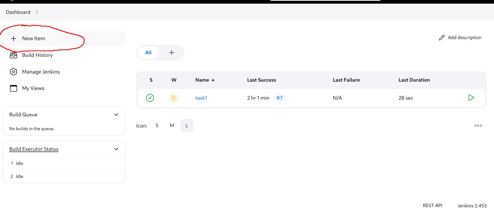
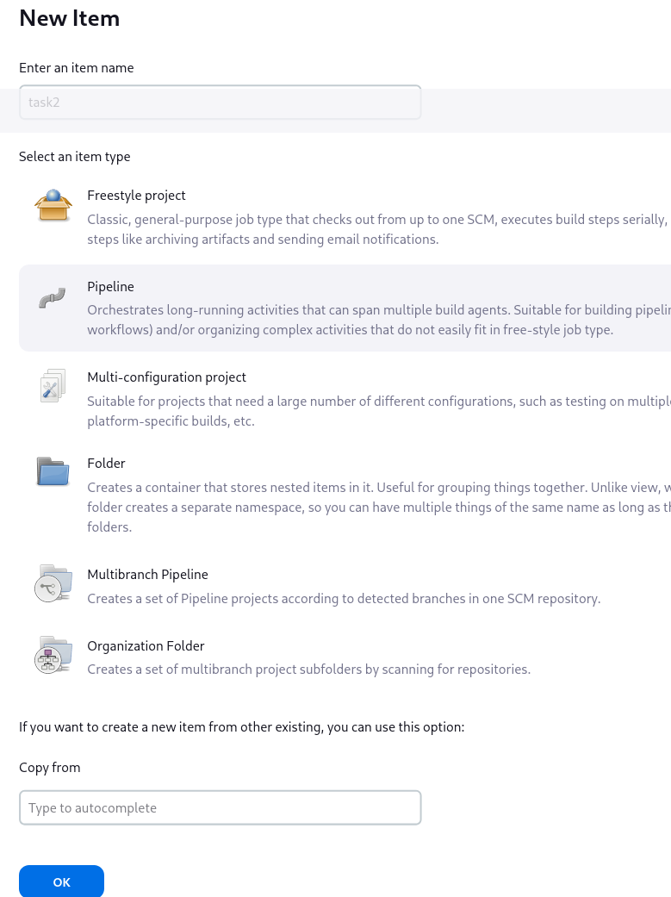
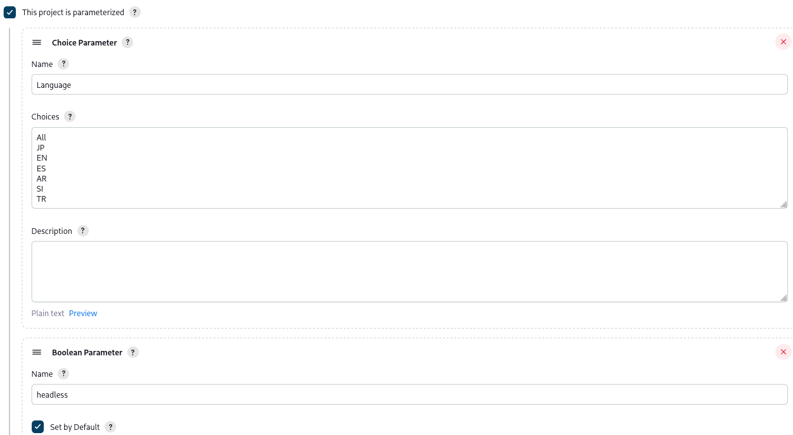

Folder structure
------------

- **jenkins-dotnet**: Jenkins service with dotnet and allure installed
- **nginx**: Nginx service
- **report_site**:  Folder contains all test result which generated by allure report and used by nginx
- **selenium-hub**: Selnium hub service
- **node-chrome**: Chrome node service with google chrome version *123.0*

Startup
------------
Use docker compose to start jenkins and nginx services
```sh
docker-compose up -d
```
After services are up, acess to **http:localhost:8080** to go to jenkins website

Setup
----
1. Acess to **http:localhost:8080**
2. Access to jenkins container and get the password using this command
```sh
docker exec -it <jenkins container> bash
cat /var/jenkins_home/secrets/initialAdminPassword
```
3. Enter the password and Press continue. Then choose **install suggested plugins**

4. When plugins are installed, you will need to create new administrator account and press **Save and Continue**

5. After everything are done. You will navigate to jenkins main page.

Create Job
------------
### Create pipeline job
1. Create Credentials for clone git repository (if neccessary)
- Dashboard -> Manage Jenkins -> Credentials -> System -> Global credentials -> Create Credentials -> Enter username & password -> Create





2. Click New Item


3. Enter Job name and choose pipeline
<br />


4. Setup paramaters 


5. Enter the scripts 
```groovy
pipeline {
    agent any

    stages {
        stage('Checkout') {
            steps {
                git branch: 'test_deployment', changelog: false, credentialsId: '<credentials id>', poll: false, url: 'https://git.d-soft.com.vn/dng.pj0026.sustech_elic_zero/automation-test'
            }
        }
        stage('Clean') {
           steps {
                catchError(buildResult: 'SUCCESS', stageResult: 'FAILURE') {
                    sh "rm -Rf ./bin"
                }
            }
        }
        stage('Build') {
            steps {
                sh 'dotnet build'
            }
        }
        stage('Testing in all language') {
            when { equals expected: "All", actual: params.Language }
            parallel {
                stage('Jp') {
                    steps {
                       catchError(buildResult: 'SUCCESS', stageResult: 'FAILURE') {
                            sh "dotnet test ./bin/Debug/net6.0/CarbonixAutomationSpec.dll --filter 'TestCategory=importCsvEvidence & TestCategory=JP'"
                        }
                    }
                }
                stage('En') {
                    steps {
                       catchError(buildResult: 'SUCCESS', stageResult: 'FAILURE') {
                            sh "dotnet test ./bin/Debug/net6.0/CarbonixAutomationSpec.dll --filter 'TestCategory=importCsvEvidence & TestCategory=EN'"
                        }
                    }
                }
                stage('Tr') {
                    steps {
                      catchError(buildResult: 'SUCCESS', stageResult: 'FAILURE') {
                            sh "dotnet test ./bin/Debug/net6.0/CarbonixAutomationSpec.dll --filter 'TestCategory=importCsvEvidence & TestCategory=TR'"
                        }
                    }
                }
                stage('Es') {
                    steps {
                      catchError(buildResult: 'SUCCESS', stageResult: 'FAILURE') {
                            sh "dotnet test ./bin/Debug/net6.0/CarbonixAutomationSpec.dll --filter 'TestCategory=importCsvEvidence & TestCategory=ES'"
                        }
                    }
                }
                stage('Si') {
                    steps {
                      catchError(buildResult: 'SUCCESS', stageResult: 'FAILURE') {
                            sh "dotnet test ./bin/Debug/net6.0/CarbonixAutomationSpec.dll --filter 'TestCategory=importCsvEvidence & TestCategory=SI'"
                        }
                    }
                }
                stage('AR') {
                    steps {
                      catchError(buildResult: 'SUCCESS', stageResult: 'FAILURE') {
                            sh "dotnet test ./bin/Debug/net6.0/CarbonixAutomationSpec.dll --filter 'TestCategory=importCsvEvidence & TestCategory=AR'"
                        }
                    }
                }
            }
        }
        stage('Testing in single language') {
            when { not { equals expected: "All", actual: params.Language } }
            steps {
               catchError(buildResult: 'SUCCESS', stageResult: 'FAILURE') {
                    sh "dotnet test ./bin/Debug/net6.0/CarbonixAutomationSpec.dll --filter 'TestCategory=importCsvEvidence & TestCategory=${params.Language}'"
                }
            }
        }
        stage('Report') {
            steps {
                sh 'allure generate ./bin/Debug/net6.0/allure-results -c -o /var/jenkins_home/allure/${PWD##*/}'
            }
        }

    }
}
```
> [!NOTE]  
> Replace \<credentials id\> with your credential id which created in previous step


View Report
------------
After job finished, to view report we need access to this url:
```
http://localhost:8888/<job name>/
```